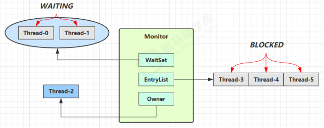

# Monitor原理

> 在介绍Monitor原理之前，首先需要了解JVM中Java对象头的相关知识

## Java对象头

​	对于普通对象来说，对象头的结构为(此处以32位虚拟机为例)

```java
|---------------------------------------------------------------|
|               Object Header(64 bits)                          |
|---------------------------------------------------------------|
|    Mark word(32 bits)        |     Klass word(32 bits)        |
|---------------------------------------------------------------|
```

​	其中Mark Word用来`存储对象自身的运行时数据区`，如哈希码、GC分代年龄等。32位和64位的虚拟机中分别会占用32或64个比特。这部分是用来实现轻量级锁:lock:和重量级锁的关键。


​	Mark Word的结构为(此处以32位虚拟机为例)

```java
|---------------------------------------------------------------|-----------------------|
|                   Mark word(32 bits)                          |         State         |
|---------------------------------------------------------------|-----------------------|
|   HashCode:25        |   age:4  |    biased_lock:0    |   01  |         Normal        |
|---------------------------------------------------------------|-----------------------|
| thread:23  |epoch:2  |   age:4  |    biased_lock:1    |   01  |         Biased        |
|---------------------------------------------------------------|-----------------------|
|                  ptr_to_lock_record:30                |   00  |  Lightweight Locked   |
|---------------------------------------------------------------|-----------------------|
|              ptr_to_heavyweight_monitor:30            |   10  |  Heavyweight Locked   |
|---------------------------------------------------------------|-----------------------|
|                                                       |   11  |    Marked for GC      |
|---------------------------------------------------------------|-----------------------|
```

​	Mark Word的结构为(此处以64位虚拟机为例)

```java
|------------------------------------------------------------------|-----------------------|
|                   Mark word(64 bits)                             |         State         |
|------------------------------------------------------------------|-----------------------|
|  unused:25 | hashcode:31 | unused:1 | age:4 | biased_lock:0 | 01 |         Normal        |
|------------------------------------------------------------------|-----------------------|
|  thread:54   | epoch:2 | unused:1 | age:4 | biased_lock:1   | 01 |        Biased        |
|------------------------------------------------------------------|-----------------------|
|                      ptr_to_lock_record:62                  | 00 |  Lightweight Locked   |
|------------------------------------------------------------------|-----------------------|
|                    ptr_to_heavyweight_monitor:62            | 10 |  Heavyweight Locked   |
|------------------------------------------------------------------|-----------------------|
|                                                            | 11  |    Marked for GC      |
|------------------------------------------------------------------|-----------------------|
```


如果是数组对象，会有一个用于存储数组长度的额外空间

```java
|----------------------------------------------------------------------------------------|
|                               Object Header(96 bits)                                   |
|---------------------------------------------------------------|------------------------|
|    Mark word(32 bits)        |     Klass word(32 bits)        |  array length(32bits)  |
|---------------------------------------------------------------|------------------------|
```

> 参考资料
>
> [jvm - What is in Java object header? - Stack Overflow](https://stackoverflow.com/questions/26357186/what-is-in-java-object-header)


## Monitor是什么

- Monitor 被翻译为监视器或管程
- 每个 Java 对象都可以关联一个 Monitor 对象，如果使用 synchronized 给对象上锁（重量级）之后，该对象头的 `Mark Word 中就被设置指向 Monitor 对象的指针`

## Monitor结构





大致流程：

1. 初始时Monitor中Owner为null
2. 当Thread-2执行synchronized(obj) 就会将 Monitor 的所有者 Owner 置为 Thread-2，Monitor 中只能有一个Owner
3. 在Thread-2还未释放锁前，如果Thread-3，Thread-4，Thread-5 也来执行 synchronized(obj)，就会进入 EntryList，状态为BLOCKED
4. Thread-2释放锁后，唤醒EntryList中等待的线程来竞争锁，竞争的时候是非公平的
5. WaitSet 中的 Thread-0，Thread-1 是之前获得过锁，但条件不满足进入 WAITING 状态的线程

> **注意:**
>
> - synchronized 必须是进入同一个对象的 monitor 才有上述的效果
> - 不加 synchronized 的对象不会关联监视器，不遵从以上规则

## 测试Monitor


现有如下代码：

```java
    static final Object lock = new Object();
    static int counter = 0;

    public static void main(String[] args) {
        synchronized (lock) {
            counter++;
        }
    }
}
```

使用javap -c 查看对应的字节码如下：

```java
public class com.monster.monitor.MonitorTest {
  static final java.lang.Object lock;

  static int counter;

  public com.monster.monitor.MonitorTest();
    Code:
       0: aload_0
       1: invokespecial #1                  // Method java/lang/Object."<init>":()V
       4: return

  public static void main(java.lang.String[]);
    Code:
       0: getstatic     #2            // Field lock:Ljava/lang/Object;// <- lock引用 （synchronized开始）
       3: dup
       4: astore_1                          // lock引用 -> slot 1
       5: monitorenter                      // 将 lock对象 MarkWord 置为 Monitor 指针
       6: getstatic     #3                  // Field counter:I  // <- i
       9: iconst_1                          // 准备常数 1
      10: iadd                              // +1
      11: putstatic     #3                  // Field counter:I // -> i
      14: aload_1                           // <- lock引用
      15: monitorexit                       // 将 lock对象 MarkWord 重置, 唤醒 EntryList
      16: goto          24
      19: astore_2                          // e -> slot 2 
      20: aload_1                           // <- lock引用
      21: monitorexit                       // 将 lock对象 MarkWord 重置, 唤醒 EntryList
      22: aload_2                           // <- slot 2 (e)
      23: athrow                            // throw e
      24: return
    Exception table:                        // 特别关注此处的异常表
       from    to  target type
           6    16    19   any
          19    22    19   any

  static {};
    Code:
       0: new           #4                  // class java/lang/Object
       3: dup
       4: invokespecial #1                  // Method java/lang/Object."<init>":()V
       7: putstatic     #2                  // Field lock:Ljava/lang/Object;
      10: iconst_0
      11: putstatic     #3                  // Field counter:I
      14: return
}
```

​	不难看出，这与我们理解的Monitor大致流程一直，Perfect！

## 拓展:javap的使用

在使用过程中，发现了一个很有意思的问题，将代码改成如下

```java
    static int counter = 0;

    public static void main(String[] args) {
        aVoid();
    }

    public static synchronized void aVoid() {
        counter++;
    }
```

使用javap -c 查看字节码如下：

```java
public class com.monster.monitor.MonitorTest {
  static final java.lang.Object lock;

  static int counter;

  public com.monster.monitor.MonitorTest();
    Code:
       0: aload_0
       1: invokespecial #1                  // Method java/lang/Object."<init>":()V
       4: return

  public static void main(java.lang.String[]);
    Code:
       0: invokestatic  #2                  // Method aVoid:()V
       3: return

  public static synchronized void aVoid();
    Code:
       0: getstatic     #3                  // Field counter:I
       3: iconst_1
       4: iadd
       5: putstatic     #3                  // Field counter:I
       8: return

  static {};
    Code:
       0: new           #4                  // class java/lang/Object
       3: dup
       4: invokespecial #1                  // Method java/lang/Object."<init>":()V
       7: putstatic     #5                  // Field lock:Ljava/lang/Object;
      10: iconst_0
      11: putstatic     #3                  // Field counter:I
      14: return
}
```

​	发现`方法级别的 synchronized 不会在字节码指令中有所体现`,这是怎么回事呢？按理说字节码中一定会有标识`ACC_SYNCHRONIZED`才对。

​	经过一番查找，不妨使用一下 javap -verbose来进行字节码查看

```java
{
  static final java.lang.Object lock;
    descriptor: Ljava/lang/Object;
    flags: ACC_STATIC, ACC_FINAL

  static int counter;
    descriptor: I
    flags: ACC_STATIC

  public com.monster.monitor.MonitorTest();
    descriptor: ()V
    flags: ACC_PUBLIC
    Code:
      stack=1, locals=1, args_size=1
         0: aload_0
         1: invokespecial #1                  // Method java/lang/Object."<init>":()V
         4: return
      LineNumberTable:
        line 3: 0
      LocalVariableTable:
        Start  Length  Slot  Name   Signature
            0       5     0  this   Lcom/monster/monitor/MonitorTest;

  public static void main(java.lang.String[]);
    descriptor: ([Ljava/lang/String;)V
    flags: ACC_PUBLIC, ACC_STATIC
    Code:
      stack=0, locals=1, args_size=1
         0: invokestatic  #2                  // Method aVoid:()V
         3: return
      LineNumberTable:
        line 12: 0
        line 13: 3
      LocalVariableTable:
        Start  Length  Slot  Name   Signature
            0       4     0  args   [Ljava/lang/String;

  public static synchronized void aVoid();
    descriptor: ()V
    flags: ACC_PUBLIC, ACC_STATIC, ACC_SYNCHRONIZED
    Code:
      stack=2, locals=0, args_size=0
         0: getstatic     #3                  // Field counter:I
         3: iconst_1
         4: iadd
         5: putstatic     #3                  // Field counter:I
         8: return
      LineNumberTable:
        line 16: 0
        line 17: 8

  static {};
    descriptor: ()V
    flags: ACC_STATIC
    Code:
      stack=2, locals=0, args_size=0
         0: new           #4                  // class java/lang/Object
         3: dup
         4: invokespecial #1                  // Method java/lang/Object."<init>":()V
         7: putstatic     #5                  // Field lock:Ljava/lang/Object;
        10: iconst_0
        11: putstatic     #3                  // Field counter:I
        14: return
      LineNumberTable:
        line 5: 0
        line 6: 10
}
SourceFile: "MonitorTest.java"
```

重点是这几行

```java
  public static synchronized void aVoid();
    descriptor: ()V
    flags: ACC_PUBLIC, ACC_STATIC, ACC_SYNCHRONIZED
```

不难发现，确实添加了ACC_SYNCHRONIZED标记。至于javap -c 与javap -verbose的区别详见：[javap的使用]([javap的使用 - 慕尘 - 博客园 (cnblogs.com)](https://www.cnblogs.com/baby123/p/10756614.html))


------


> **本文参考链接**
>
> [JUC并发编程](https://www.bilibili.com/video/BV16J411h7Rd?p=1) |  [javap的使用]([javap的使用 - 慕尘 - 博客园 (cnblogs.com)](https://www.cnblogs.com/baby123/p/10756614.html))  |  [synchronized使用与字节码说明](https://blog.csdn.net/u010606397/article/details/109243630)
>
> [3种骚操作，教你查看 Java 字节码](https://zhuanlan.zhihu.com/p/287971103)  |  [markdown画图](https://blog.csdn.net/lis_12/article/details/80693975)

