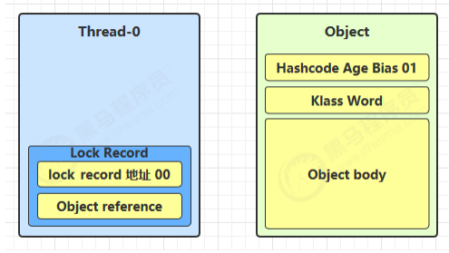
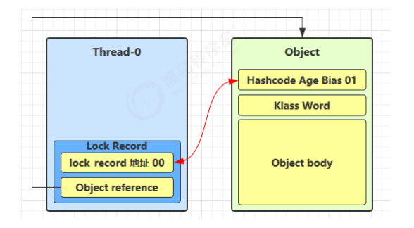
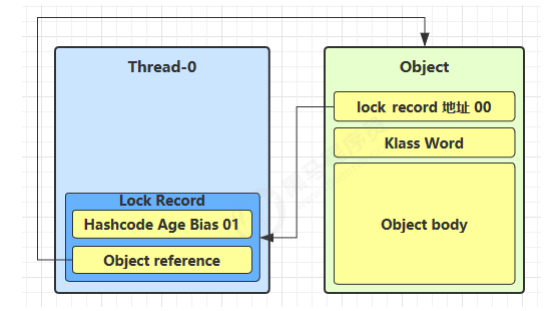
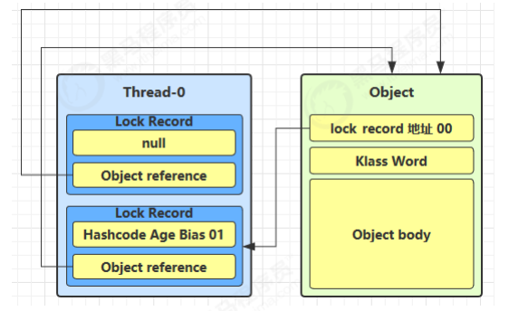
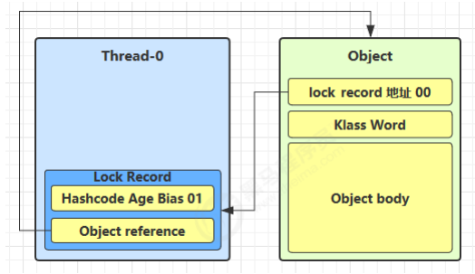
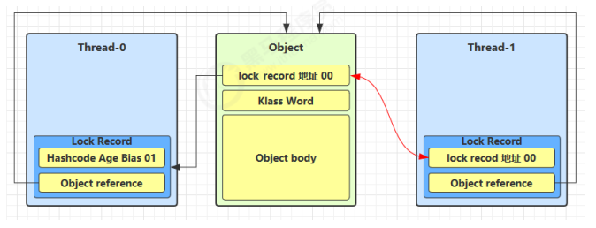
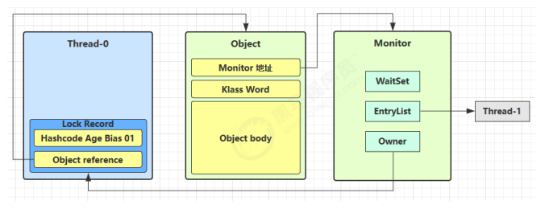
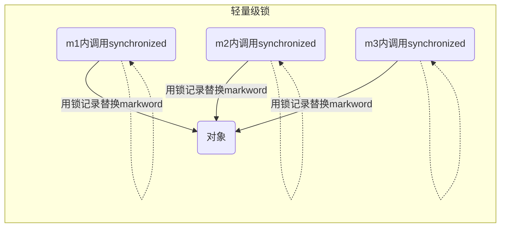
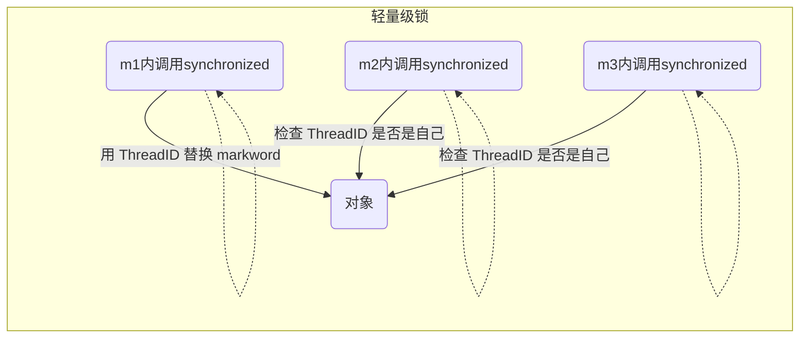

# synchronized原理

​	在了解synchronized原理之前，请先确保了解[Monitor原理](./monitor原理.md)

## 1.轻量级锁

轻量级锁的使用场景：如果一个对象虽然有多线程要加锁，但加锁的时间是错开的（也就是`没有竞争`），那么可以 使用轻量级锁来优化

轻量级锁对使用者是透明的，即语法仍然是 synchronized

假设有两个方法同步块，利用同一个对象加锁

```java
    static final Object obj = new Object();
    public static void method1() {
        synchronized( obj ) {
            // 同步块 A
            method2();
        }
    }
    public static void method2() {
        synchronized( obj ) {
            // 同步块 B
        }
    }
```

其执行流程大致如下：

- 创建锁记录（Lock Record）对象:线程Thread-0在自己的栈帧中创建了一个锁记录

> **Lock Record:** 每个线程都的栈帧都会包含一个锁记录的结构，内部可以存储锁定对象的 Mark Word



- 让锁记录中 Object reference 指向锁对象，并尝试用 cas 替换 Object 的 Mark Word，将 Mark Word 的值存入锁记录



- 如果 cas 替换成功，对象头中存储了 `锁记录地址和状态 00 `，表示由该线程给对象加锁，这时图示如下





- 如果 cas 失败，有两种情况
  - 如果是其它线程已经持有了该 Object 的轻量级锁，这时表明有竞争，进入[锁膨胀](#sec)过程
  - 如果是自己执行了 synchronized 锁重入，那么`再添加一条 Lock Record `作为重入的计数




- 当退出 synchronized 代码块（解锁时）如果有取值为 null 的锁记录，表示有重入，这时重置锁记录，表示`重入计数减一`



- 当退出 synchronized 代码块（解锁时）锁记录的值不为 null，这时使用 cas 将 Mark Word 的值恢复给对象头
  - 成功，则解锁成功
  - 失败，说明轻量级锁进行了锁膨胀或已经升级为重量级锁，进入重量级锁解锁流程

## <span id="sec">2.锁膨胀</span>


​	如果在尝试加轻量级锁的过程中，CAS 操作无法成功，这时一种情况就是有`其它线程为此对象加上了轻量级锁（有竞争）`，这时需要进行锁膨胀，将轻量级锁变为重量级锁。

​	下面通过举例说明：

```java
    static Object obj = new Object();
    public static void method1() {
        synchronized( obj ) {
            // 同步块
        }
    }
```

- 当 Thread-1 进行轻量级加锁时，Thread-0 已经对该对象加了轻量级锁



- 这时 Thread-1 加轻量级锁失败，进入锁膨胀流程
  - 即`为Object对象申请Monitor锁`，让 Object 指向重量级锁地址
  - 然后`自己进入 Monitor 的 EntryList，处于BLOCKED`



- 当 Thread-0 退出同步块解锁时，使用 cas 将 Mark Word 的值恢复给对象头，失败(此时markword中没有锁记录的值了)
  - 这时会进入重量级解锁 流程，即按照 Monitor 地址找到 Monitor 对象，设置 Owner 为 null，唤醒 EntryList 中 BLOCKED 线程

> **问题：**
>
> ​	锁记录去哪里了？

## 3.自旋优化

​	重量级锁竞争的时候，还可以使用自旋来进行优化，如果当前线程自旋成功（即这时候持锁线程已经退出了同步块，释放了锁），这时当前线程就可以避免阻塞。

### 自旋重试成功的情况

| **线程 1 （core 1 上）** | **对象 Mark**              | **线程 2 （core 2 上）** |
| ------------------------ | -------------------------- | ------------------------ |
| -                        | 10（重量级锁）             | -                        |
| 访问同步块，获取 monitor | 10（重量级锁）重量级锁指针 | -                        |
| 成功（加锁）             | 10（重量级锁）重量级锁指针 | -                        |
| 执行同步块               | 10（重量级锁）重量级锁指针 | -                        |
| 执行同步块               | 10（重量级锁）重量级锁指针 | 访问同步块，获取 monitor |
| 执行同步块               | 10（重量级锁）重量级锁指针 | 失败， 自旋重试          |
| 执行完毕                 | 10（重量级锁）重量级锁指针 | 失败， 自旋重试          |
| -                        | 无锁                       | 失败， 自旋重试          |
| -                        | 10（重量级锁）重量级锁指针 | （加锁）                 |
| -                        | 10（重量级锁）重量级锁指针 | 执行同步块               |
| ...                      | ...                        | ...                      |

### 自旋重试失败的情况

| **线程 1 （core 1 上）** | **对象 Mark**              | **线程 2 （core 2 上）** |
| ------------------------ | -------------------------- | ------------------------ |
| -                        | 10（重量级锁）             | -                        |
| 访问同步块，获取 monitor | 10（重量级锁）重量级锁指针 | -                        |
| 成功（加锁）             | 10（重量级锁）重量级锁指针 | -                        |
| 执行同步块               | 10（重量级锁）重量级锁指针 | -                        |
| 执行同步块               | 10（重量级锁）重量级锁指针 | 访问同步块，获取 monitor |
| 执行同步块               | 10（重量级锁）重量级锁指针 | 失败， 自旋重试          |
| 执行同步块               | 10（重量级锁）重量级锁指针 | 失败， 自旋重试          |
| 执行同步块               | 10（重量级锁）重量级锁指针 | 失败， 自旋重试          |
| 执行同步块               | 10（重量级锁）重量级锁指针 | 失败， 自旋重试          |
| 执行同步块               | 10（重量级锁）重量级锁指针 | 阻塞                     |
| ...                      | ...                        | ...                      |

- 自旋会占用 CPU 时间，`单核 CPU 自旋就是浪费`，多核 CPU 自旋才能发挥优势
- 在 Java 6 之后自旋锁是自适应的，比如对象刚刚的一次自旋操作成功过，那么认为这次自旋成功的可能性会 高，就多自旋几次；反之，就少自旋甚至不自旋，总之，比较智能
- Java 7 之后不能控制是否开启自旋功能

## 4.偏向锁

​	轻量级锁在没有竞争时（就自己这个线程），每次重入仍然需要执行 CAS 操作，这样是非常没必要的

​	Java 6 中引入了偏向锁来做进一步优化：只有第一次使用 CAS 将线程 ID 设置到对象的 Mark Word 头，之后`发现这个线程 ID 是自己`的就表示没有竞争，不用重新 CAS。`以后只要不发生竞争，这个对象就归该线程所有`。

### 图示

```java
    static final Object obj = new Object();
    public static void m1() {
        synchronized( obj ) {
            // 同步块 A
            m2();
        }
    }
    public static void m2() {
        synchronized( obj ) {
            // 同步块 B
            m3();
        }
    }
    public static void m3() {
        synchronized( obj ) {
            // 同步块 C
        }
    }
```






### 偏向状态

​	回忆一下对象头的格式（以64位机器为例）

```java
|------------------------------------------------------------------|-----------------------|
|                   Mark word(64 bits)                             |         State         |
|------------------------------------------------------------------|-----------------------|
|  unused:25 | hashcode:31 | unused:1 | age:4 | biased_lock:0 | 01 |         Normal        |
|------------------------------------------------------------------|-----------------------|
|  thread:54   | epoch:2 | unused:1 | age:4 | biased_lock:1   | 01 |        Biased        |
|------------------------------------------------------------------|-----------------------|
|                      ptr_to_lock_record:62                  | 00 |  Lightweight Locked   |
|------------------------------------------------------------------|-----------------------|
|                    ptr_to_heavyweight_monitor:62            | 10 |  Heavyweight Locked   |
|------------------------------------------------------------------|-----------------------|
|                                                            | 11  |    Marked for GC      |
|------------------------------------------------------------------|-----------------------|
```

一个对象创建时： 

- 如果开启了偏向锁（默认开启），那么对象创建后，markword 值为 0x05，即最后 3 位为 101，这时它的 thread、epoch、age 都为 0 
- 偏向锁是默认是延迟(4s)的，不会在程序启动时立即生效，如果想避免延迟，可以加 VM 参数 -XX:BiasedLockingStartupDelay=0 来禁用延迟 
- 如果没有开启偏向锁，那么对象创建后，markword 值为 0x01 即最后 3 位为 001，这时它的 hashcode、 age 都为 0，第一次用到 hashcode 时才会赋值（即`调用hashcode会将对象置位正常状态`）

#### 测试偏向锁

```xml
        <dependency>
            <groupId>org.openjdk.jol</groupId>
            <artifactId>jol-core</artifactId>
            <version>0.16</version>
            <!--此处踩坑，注意不要provided  <scope>provided</scope>-->
        </dependency>
```


```java
    public static void main(String[] args) throws InterruptedException {

        Thread.sleep(4100);

        Dog dog = new Dog();
        ClassLayout classLayout = ClassLayout.parseInstance(dog);
        new Thread(() -> {
            System.out.println("synchronized 前");
            System.out.println(classLayout.toPrintable());

            synchronized (dog) {
                System.out.println("synchronized中");
                System.out.println(classLayout.toPrintable());
            }

            System.out.println("synchronized 后");
            System.out.println(classLayout.toPrintable());
            
            dog.hashCode();
            System.out.println(classLayout.toPrintable());

        }, "a").start();
    }
```


执行上述代码后结果如下


```java
synchronized 前
com.monster.monitor.Dog object internals:
OFF  SZ   TYPE DESCRIPTION               VALUE
  0   8        (object header: mark)     0x0000000000000005 (biasable; age: 0)
  8   4        (object header: class)    0xf800c143
 12   4        (object alignment gap)    
 
synchronized 中
com.monster.monitor.Dog object internals:
OFF  SZ   TYPE DESCRIPTION               VALUE
  0   8        (object header: mark)     0x000000001f01a005 (biased: 0x000000000007c068; epoch: 0; age: 0)
  8   4        (object header: class)    0xf800c143
 12   4        (object alignment gap) 
 
synchronized 后
com.monster.monitor.Dog object internals:
OFF  SZ   TYPE DESCRIPTION               VALUE
  0   8        (object header: mark)     0x000000001f01a005 (biased: 0x000000000007c068; epoch: 0; age: 0)
  8   4        (object header: class)    0xf800c143
 12   4        (object alignment gap)   
    
OFF  SZ   TYPE DESCRIPTION               VALUE
  0   8        (object header: mark)     0x00000073eb0b6701 (hash: 0x73eb0b67; age: 0)
  8   4        (object header: class)    0xf800c143
 12   4        (object alignment gap)    
```

> 不难发现
>
> - JDK8默认开启了偏向锁
> - 处于偏向锁的对象解锁后，线程id仍处于对象头，即该对象归该线程所有\
> - 正常状态对象一开始是没有 hashCode 的，第一次调用才生成
>   - 调用hashCode 会将偏向状态(101)的对象转到正常(001),这就涉及到了[锁的撤销](#four)

### <span id="four">偏向锁撤销</span>

#### 调用对象hashCode

​	调用了对象的 hashCode，但偏向锁的对象 MarkWord 中存储的是线程 id，如果调用 hashCode 会导致偏向锁被撤销

- 轻量级锁会在锁记录中记录 hashCode
- 重量级锁会在 Monitor 中记录 hashCode 在调用 hashCode 后使用偏向锁，记得去掉 -XX:-UseBiasedLocking

#### 其它线程使用对象

​	当有其它线程使用偏向锁对象时，会将偏向锁升级为轻量级锁

#### 调用 wait/notify

​	使用wait/notify是对象在重量级锁的情况下，这是由于要将线程放入monitor的等待队列中

### 批量重偏向

​	如果对象虽然被多个线程访问，但没有竞争，这时偏向了线程 T1 的对象仍有机会重新偏向 T2，重偏向会重置对象 的 Thread ID 	当撤销偏向锁阈值超过 20 次后，jvm 会这样觉得，我是不是偏向错了呢，于是会在给这些对象加锁时重新偏向至加锁线程

### 批量撤销

​	当撤销偏向锁阈值超过 40 次后，jvm 会这样觉得，自己确实偏向错了，根本就不该偏向。于是整个类的所有对象 都会变为不可偏向的，新建的对象也是不可偏向的


### 简单总结

- 批量重偏向和批量撤销是针对类的优化，和对象无关。

- 偏向锁重偏向一次之后不可再次重偏向。

- 当某个类已经触发批量撤销机制后，JVM会默认当前类产生了严重的问题，剥夺了该类的新实例对象使用偏向锁的权利

## 5.锁消除

​	使用-XX:-EliminateLocks可进行锁消除

## 6.锁粗化

​	对相同对象多次加锁，导致线程发生多次重入，可以使用锁粗化方式来优化，这不同于之前讲的细分锁的粒度。


------


**本文参考链接**

[JUC并发编程](https://www.bilibili.com/video/BV16J411h7Rd?p=1) |  [markdown 画图](https://blog.csdn.net/whatday/article/details/88655461)  |  [DK8偏向锁](https://blog.csdn.net/shiyueshis/article/details/115477836)  |  [偏向锁论文](https://www.oracle.com/technetwork/java/biasedlocking-oopsla2006-wp-149958.pdf)

[死磕Synchronized底层实现](https://github.com/farmerjohngit/myblog/issues/12)  |  [盘一盘 synchronized （一）](https://www.cnblogs.com/LemonFive/p/11246086.html) |  [盘一盘 synchronized （二）](https://www.cnblogs.com/LemonFive/p/11248248.html)

[为什么要用JMH](https://www.zhihu.com/question/276455629)
