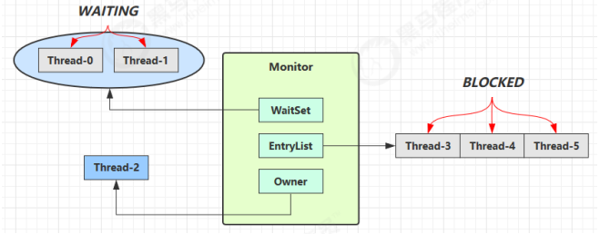

# wait-notify原理及正确使用

## 原理




- 新来的线程发现Owner已有，即发现条件不满足，于是调用wait方法，即可进入WaitSet变为Waiting状态
- BLOCKED 和 WAITING 的线程都处于阻塞状态，不占用 CPU 时间片
- BLOCKED 线程会在 Owner 线程释放锁时唤醒
- WAITING 线程会在 Owner 线程调用 notify 或 notifyAll 时唤醒，但唤醒后并不意味者立刻获得锁，仍需进入 EntryList 重新竞争

## API 介绍

- obj.wait() 让进入object监视器的线程到 waitSet 等待
- obj.notify() 在object上正在waitSet等待的线程中挑一个唤醒
- obj.notifyAll() 让object上正在waitSet等待的线程全部唤醒

它们都是线程之间进行协作的手段，都属于 Object 对象的方法。必须获得此对象的锁，才能调用这几个方法


```java
    final static Object obj = new Object();
    public static void main(String[] args) throws InterruptedException {
        new Thread(() -> {
            synchronized (obj) {
                System.out.println("执行....");
                try {
                    obj.wait(); // 让线程在obj上一直等待下去
                } catch (InterruptedException e) {
                    e.printStackTrace();
                }
                System.out.println(Thread.currentThread().getName()+"其它代码....");
            }
        },"t1").start();
        new Thread(() -> {
            synchronized (obj) {
                System.out.println("执行....");
                try {
                    obj.wait(); // 让线程在obj上一直等待下去
                } catch (InterruptedException e) {
                    e.printStackTrace();
                }
                System.out.println(Thread.currentThread().getName()+"其它代码....");
            }
        },"t2").start();
        // 主线程两秒后执行
        Thread.sleep(2);
        System.out.println("唤醒 obj 上其它线程");
        synchronized (obj) {
//            obj.notify(); // 唤醒obj上一个线程
             obj.notifyAll(); // 唤醒obj上所有等待线程
        }
    }
```

notifyAll()的结果

```java、
执行....
执行....
唤醒 obj 上其它线程
t2其它代码....
t1其它代码....
```

修改一下代码，测试一下wait是否会释放对象的锁

```java
    final static Object obj = new Object();
    public static void main(String[] args) throws InterruptedException {
        new Thread(() -> {
            synchronized (obj) {
                System.out.println("执行....");
                try {
                    Thread.sleep(2000);
                    obj.wait(); // 让线程在obj上一直等待下去
                } catch (InterruptedException e) {
                    e.printStackTrace();
                }
                System.out.println(Thread.currentThread().getName()+"其它代码....");
            }
        },"t1").start();


        synchronized (obj) {
            System.out.println("主线程执行1");
        }
        // 主线程两秒后执行
        Thread.sleep(4000);

        synchronized (obj) {
            System.out.println("主线程执行2");
            obj.notify();
        }
    }
```

执行结果如下：

```java
主线程执行1
执行....
主线程执行2
t1其它代码....
```


> `wait() `方法会释放对象的锁，进入 WaitSet 等待区，从而让其他线程就机会获取对象的锁。无限制等待，直到 notify 为止 `wait(long n) `有时限的等待, 到 n 毫秒后结束等待，或是被 notify

另外不难总结出**sleep(long n) 和 wait(long n) 的区别**

- sleep 是 Thread 方法，而 wait 是 Object 的方法
- sleep 不需要强制和 synchronized 配合使用，但 wait 需要 和 synchronized 一起用
- sleep 在睡眠的同时，不会释放对象锁的，但 wait 在等待的时候会释放对象锁
- 它们状态都是TIMED_WAITING


## wait/notify的正确姿势

### step 1

先从一个例子开始说起，下面有一段代码，思考一下存在什么问题？

```java
    static final Object room = new Object();
    static boolean hasCigarette = false;

    public static void main(String[] args) throws InterruptedException {
        new Thread(() -> {
            synchronized (room) {
                System.out.println("有烟吗？" + hasCigarette);
                if (!hasCigarette) {
                    System.out.println("没烟，先歇会！");
                    try {
                        Thread.sleep(2000);
                    } catch (InterruptedException e) {
                        e.printStackTrace();
                    }
                }
                System.out.println("有烟吗？" + hasCigarette);
                if (hasCigarette) {
                    System.out.println("可以开始干活了");
                }
            }
        }, "小南").start();
        for (int i = 0; i < 5; i++) {
            new Thread(() -> {
                synchronized (room) {
                    System.out.println("可以开始干活了");
                }
            }, "其它人").start();
        }
        Thread.sleep(1000);
        new Thread(() -> {
            // 这里能不能加 synchronized (room)？
            hasCigarette = true;
            System.out.println("烟到了噢");
        }, "送烟的").start();

    }
```

输出如下

```java
有烟吗？false
没烟，先歇会！
烟到了噢
有烟吗？true
可以开始干活了
可以开始干活了
可以开始干活了
可以开始干活了
可以开始干活了
可以开始干活了
```

不难发现

- 其他干活的线程，都要一直阻塞，效率太低
- 小南线程必须睡足2S后才能醒来，就算烟提前送到，也无法立刻醒来
- 加了 synchronized (room) 后，就好比小南在里面反锁了门睡觉，烟根本没法送进门
- main 没加 synchronized 就好像 main 线程是翻窗户进来的
- 解决方法，使用 wait - notify 机制

### step 2 

使用wait - notify 机制进行改造

```java
    static final Object room = new Object();
    static boolean hasCigarette = false;

    public static void main(String[] args) throws InterruptedException {
        new Thread(() -> {
            synchronized (room) {
                System.out.println("有烟吗？" + hasCigarette);
                if (!hasCigarette) {
                    System.out.println("没烟，先歇会！");
                    try {
                        room.wait(2000);
                    } catch (InterruptedException e) {
                        e.printStackTrace();
                    }
                }
                System.out.println("有烟吗？" + hasCigarette);
                if (hasCigarette) {
                    System.out.println("可以开始干活了");
                }
            }
        }, "小南").start();
        for (int i = 0; i < 5; i++) {
            new Thread(() -> {
                synchronized (room) {
                    System.out.println("可以开始干活了");
                }
            }, "其它人").start();
        }

        Thread.sleep(1000);
        new Thread(() -> {
            // 思考这里为什么必须加synchronized (room)？
            synchronized (room) {
                hasCigarette = true;
                System.out.println("烟到了噢");
                room.notify();
            }
        }, "送烟的").start();

    }
```

```java
有烟吗？false
没烟，先歇会！
可以开始干活了
可以开始干活了
可以开始干活了
可以开始干活了
可以开始干活了
烟到了噢
有烟吗？true
可以开始干活了
```

> **为什么必须加synchronized (room)？**
>
> ​	使用notify()的前提是必须拥有锁，如果不加synchronized (room)，会产生IllegalMonitorStateException

- 解决了其它干活的线程阻塞的问题

- 但如果有其它线程也在等待条件呢？
  - notify只能随机唤醒WaitSet中的一个线程，这时如果有其它线程也在等待，那么就可能唤醒不了正确的线程，称之为【虚假唤醒】
  - 不难想到，可以使用notifyALl

### step 3

```java
new Thread(() -> {
    // 思考这里为什么必须加synchronized (room)？
    synchronized (room) {
        hasCigarette = true;
        System.out.println("烟到了噢");
        room.notifyAll();
    }
}, "送烟的").start();
```

但是不难发现，此时出现了新的问题，如果在小南休息时间内烟没用送到，后续送到了小南也无法知道

- 用 notifyAll 仅解决某个线程的唤醒问题，但使用 if + wait 判断仅有一次机会，一旦条件不成立，就没有重新判断的机会了
- 解决方法，用 while + wait，当条件不成立，再次 wait

### step 4

将if改为while

```java
while (!hasCigarette) {
       System.out.println("没烟，先歇会！");
  try {
       room.wait(2000);
  } catch (InterruptedException e) {
       e.printStackTrace();
  }
 }
```

```java
有烟吗？false
没烟，先歇会！
可以开始干活了
可以开始干活了
可以开始干活了
可以开始干活了
可以开始干活了
没烟，先歇会！
没烟，先歇会！
烟到了噢
有烟吗？true
可以开始干活了
```

### 总结

​	wait/notify的正确使用姿势

```java
synchronized(lock) {
  while(条件不成立) {
     lock.wait();
  }
     // 干活
}
//另一个线程
synchronized(lock) {
      lock.notifyAll();
}
```


> **本文参考链接**
>
> [JUC并发编程](https://www.bilibili.com/video/BV16J411h7Rd?p=1)

