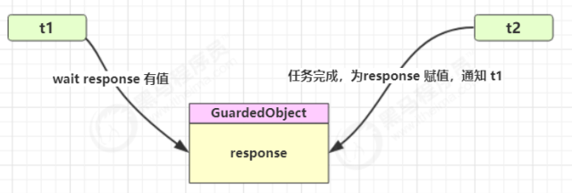

# 保护性暂停

## 定义

​	即 Guarded Suspension，用在一个线程等待另一个线程的执行结果

要点：

- 有`一个结果`需要从一个线程传递到另一个线程，让他们关联同一个GuardedObject
- 如果有结果`不断`从一个线程到另一个线程那么可以使用消息队列(见生产者/消费者)
- JDK中，join的实现、Future的实现，采用的就是此模式
- 因为要等待另一方的结果，因此归类到同步模式



## 实现

```java
public class GuardedObject {

    private Object response;
    private final Object lock = new Object();

    public Object get() {
        synchronized (lock) {
            while (response == null) {
                try {
                    lock.wait();
                } catch (InterruptedException e) {
                    e.printStackTrace();
                }
            }
            return response;
        }
    }

    public void complete(Object response) {
        synchronized (lock) {
            this.response = response;
            lock.notifyAll();
        }
    }
}
```

