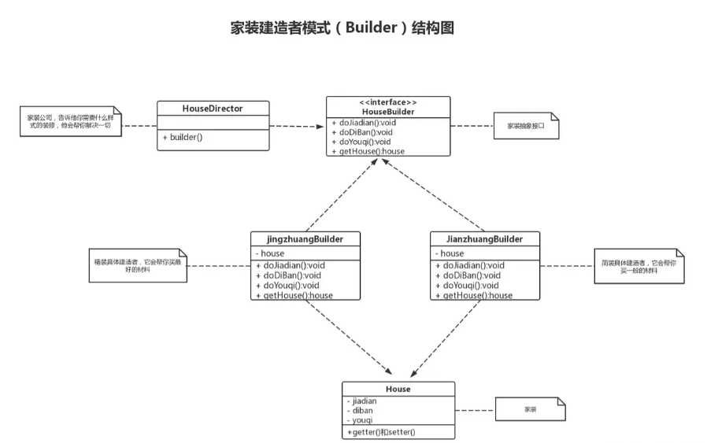
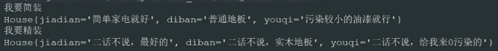

> ​	在软件开发过程中有时需要**创建一个复杂的对象**，这个复杂对象通常由多个子部件按一定的步骤组合而成。例如，计算机是由 CPU、主板、内存、硬盘、显卡、机箱、显示器、键盘、鼠标等部件组装而成的，采购员不可能自己去组装计算机，而是将计算机的配置要求告诉计算机销售公司，计算机销售公司安排技术人员去组装计算机，然后再交给要买计算机的采购员。

> ​	生活中这样的例子很多，如游戏中的不同角色，其性别、个性、能力、脸型、体型、服装、发型等特性都有所差异；还有汽车中的方向盘、发动机、车架、轮胎等部件也多种多样；每封电子邮件的发件人、收件人、主题、内容、附件等内容也各不相同。

> ​	以上所有这些产品都是由多个部件构成的，各个部件可以灵活选择，但其创建步骤都大同小异。这类产品的创建无法用前面介绍的工厂模式描述，只有建造者模式可以很好地描述该类产品的创建。

------

## 建造者模式介绍

### 是什么

​	Builder 模式中文叫作，又叫生成器模式，它属于对象创建型模式，是**将一个复杂对象的构建与它的表示分离，使得同样的构建过程可以创建不同的表示**。建造者模式是一步一步创建一个复杂的对象，它允许用户只通过指定复杂对象的类型和内容就可以构建它们，用户不需要知道内部的具体构建细节。

​	简单来说，就是一步步创建一个对象，它对用户屏蔽了里面构建的细节，但却可以精细地控制对象的构造过程

### 特点

该模式的主要优点如下：

- 封装性好，构建和表示分离。
- 扩展性好，各个具体的建造者相互独立，有利于系统的解耦。
- 客户端不必知道产品内部组成的细节，建造者可以对创建过程逐步细化，而不对其它模块产生任何影响，便于控制细节风险。


其缺点如下：

- 产品的组成部分必须相同，这限制了其使用范围。
- 如果产品的内部变化复杂，如果产品内部发生变化，则建造者也要同步修改，后期维护成本较大。

### 与工厂模式区别

​	建造者模式更加注重方法的调用顺序，工厂模式注重创建对象

​	创建对象的力度不同，建造者模式创建复杂的对象，由各种复杂的部件组成，工厂模式创建出来的对象都一样

​	关注重点不一样，工厂模式只需要把对象创建出来就可以了，而建造者模式不仅要创建出对象，还要知道对象由哪些部件组成。

​	建造者模式根据建造过程中的顺序不一样，最终对象部件组成也不一样。

### 结构

建造者（Builder）模式由产品、抽象建造者、具体建造者、指挥者 等 4 个要素构成

建造者（Builder）模式的主要角色如下。

1. 产品角色（Product）：它是包含多个组成部件的复杂对象，由具体建造者来创建其各个零部件。
2. 抽象建造者（Builder）：它是一个包含创建产品各个子部件的抽象方法的接口，通常还包含一个返回复杂产品的方法 getResult()。
3. 具体建造者(Concrete Builder）：实现 Builder 接口，完成复杂产品的各个部件的具体创建方法。
4. 指挥者（Director）：它调用建造者对象中的部件构造与装配方法完成复杂对象的创建，在指挥者中不涉及具体产品的信息。


------

## 应用举例-家装

​	家装不管是精装还是简装，它的流程都相对固定，所以它适用于建造者模式。我们就以家装为例，一起来学习了解一下建造者模式。下图是家装建造者模式简单的 UML 图。





### 家装对象类

```java
/**
 * 家装对象类
 */
public class House {
    // 买家电
    private String jiadian;

    // 买地板
    private String diban;
    // 买油漆
    private String youqi;

    public String getJiadian() {
        return jiadian;
    }

    public void setJiadian(String jiadian) {
        this.jiadian = jiadian;
    }

    public String getDiban() {
        return diban;
    }

    public void setDiban(String diban) {
        this.diban = diban;
    }

    public String getYouqi() {
        return youqi;
    }

    public void setYouqi(String youqi) {
        this.youqi = youqi;
    }

    @Override
    public String toString() {
        return "House{" +
                "jiadian='" + jiadian + '\'' +
                ", diban='" + diban + '\'' +
                ", youqi='" + youqi + '\'' +
                '}';
    }
}
```

### 抽象建造者 Builder 类

```java
/**
 * 抽象建造者
 */
public interface HouseBuilder {
    // 买家电
    void doJiadian();
    // 买地板
    void doDiBan();
    // 买油漆
    void doYouqi();

    House getHouse();
}
```

### 具体建造者－简装建造者类

```java
/**
 * 简装创建者
 */
public class JianzhuangBuilder implements HouseBuilder {

    private House house = new House();

    @Override
    public void doJiadian() {
        house.setJiadian("简单家电就好");
    }

    @Override
    public void doDiBan() {
        house.setDiban("普通地板");
    }

    @Override
    public void doYouqi() {
        house.setYouqi("污染较小的油漆就行");
    }

    @Override
    public House getHouse() {
        return house;
    }
}
```

### 具体建造者－精装建造者类

```java
/**
 * 精装创建者
 */
public class jingzhuangBuilder implements HouseBuilder {

    private House house = new House();

    @Override
    public void doJiadian() {
        house.setJiadian("二话不说，最好的");
    }

    @Override
    public void doDiBan() {
        house.setDiban("二话不说，实木地板");
    }

    @Override
    public void doYouqi() {
        house.setYouqi("二话不说，给我来0污染的");
    }

    @Override
    public House getHouse() {
        return house;
    }
}
```

### 指挥官－家装公司类

```java
/**
 * 家装公司，值需要告诉他精装还是简装
 */
public class HouseDirector {

    public House builder(HouseBuilder houseBuilder){
        houseBuilder.doDiBan();
        houseBuilder.doJiadian();
        houseBuilder.doYouqi();
        return houseBuilder.getHouse();
    }
}
```

### 测试

```java
public class App {
    public static void main(String[] args) {
        house();
    }

    public static void house(){
        HouseDirector houseDirector = new HouseDirector();
        // 简装
        JianzhuangBuilder jianzhuangBuilder = new JianzhuangBuilder();
        System.out.println("我要简装");
        System.out.println(houseDirector.builder(jianzhuangBuilder));

        // 精装
        jingzhuangBuilder jingzhuangBuilder = new jingzhuangBuilder();
        System.out.println("我要精装");
        System.out.println(houseDirector.builder(jingzhuangBuilder));

    }
}
```

输出结果





​	我们以家装为例，实现了两个具体的建造者，一个简装建造者、一个精装建造者。我们只需要告诉家装公司，我是需要简装还是精装，他会去帮我们安排，我不需要知道里面具体的细节。怎么样，建造者模式学回了吗？

------

## 应用举例-StringBuilder

java.lang.StringBuilder 中的建造者模式：

```java
public class OrginBuilder {
     public static void main(String[] args) {
        StringBuilder builder = new StringBuilder("hello");
        builder.append("world");
    }
}
```

​	进入 append 方法，会发现 StringBuilder 类即就是我们所说的指挥者。建造方法的具体实现是由 AbstractStringBuilder 实现。

```java
     @Override
     public StringBuilder append(String str) {
         super.append(str);
         return this;
     }
```

​	进入 AbstractStringBuilder 类，实现了 Appendable 接口方法，此类已是建造者，只是不能实例化。

```java
 public AbstractStringBuilder append(String str) {
     if (str == null)
         return appendNull();
     int len = str.length();
     ensureCapacityInternal(count + len);
     str.getChars(0, len, value, count);
     count += len;
     return this;
 }
```

Appendable 接口定义了多个 append 方法（抽象方法），既 Appendle 为抽象建造者，定义了抽象方法。

```java
 public interface Appendable {
 
     Appendable append(CharSequence csq) throws IOException;  
     ......
 }
```

------

## 应用举例-MyBatis

> ​	MyBatis 中 SqlSessionFactoryBuiler 类用到了建造者模式。且在 MyBatis 中 SqlSessionFactory是由 SqlSessionFactoryBuilder 产生的，代码如下：

```java
public SqlSessionFactory build(Configuration config) {
    return new DefaultSqlSessionFactory(config);
}
```

> ​	DefaultSqlSessionFactory 的构造器需要传入 MyBatis 核心配置类 Configuration 的对象作为参数，而 Configuration 庞大复杂，初始化比较麻烦，因此使用了专门的建造者 XMLConfigBuilder 进行构建。

```java
public SqlSessionFactory build(InputStream inputStream, String environment, Properties properties) {
    try {
        // 创建建造者XMLConfigBuilder实例
        XMLConfigBuilder parser = new XMLConfigBuilder(inputStream, environment, properties);
        // XMLConfigBuilder的parse()构建Configuration实例
        return build(parser.parse());
    } catch (Exception e) {
        throw ExceptionFactory.wrapException("Error building SqlSession.", e);
    } finally {
        ErrorContext.instance().reset();
        try {
            inputStream.close();
        } catch (IOException e) {
            // Intentionally ignore. Prefer previous error.
        }
    }
}
```

> XMLConfigBuilder 负责 Configuration 各个组件的创建和装配，整个装配的流程化过程如下：

```java
private void parseConfiguration(XNode root) {
    try {
        //issue #117 read properties first
        // Configuration#
        propertiesElement(root.evalNode("properties"));
        Properties settings = settingsAsProperties(root.evalNode("settings"));
        loadCustomVfs(settings);
        typeAliasesElement(root.evalNode("typeAliases"));
        pluginElement(root.evalNode("plugins"));
        objectFactoryElement(root.evalNode("objectFactory"));
        objectWrapperFactoryElement(root.evalNode("objectWrapperFactory"));
        reflectorFactoryElement(root.evalNode("reflectorFactory"));
        settingsElement(settings);
        // read it after objectFactory and objectWrapperFactory issue #631
        environmentsElement(root.evalNode("environments"));
        databaseIdProviderElement(root.evalNode("databaseIdProvider"));
        typeHandlerElement(root.evalNode("typeHandlers"));
        mapperElement(root.evalNode("mappers"));
    } catch (Exception e) {
        throw new BuilderException("Error parsing SQL Mapper Configuration. Cause: " + e, e);
    }
}
```

> ​	XMLConfigBuilder 负责创建复杂对象 Configuration，其实就是一个具体建造者角色。
>
> ​	SqlSessionFactoryBuilder 只不过是做了一层封装去构建 SqlSessionFactory 实例，这就是建造者模式简化构建的过程。

------

## 进阶-静态内部类

在日常开发中，你是不是会经常看到下面这种代码:

```java
return new Docket(DocumentationType.SWAGGER_2)
     .apiInfo(apiInfo())
     .select()
     .apis(RequestHandlerSelectors.basePackage("com.curry.springbootswagger.controller"))
     .paths(PathSelectors.any())
     .build();
```

​	是不是很优美？学会了 Builder 模式之后，你也可以通过这种方式进行对象构建。它是通过变种的 Builder 模式实现的。先不解释了，我们先用 Builder 模式来实现跟上述的对象构建，使用学生类为例。

学生对象代码：

```java
public class Student {

    private String name;

    private int age;

    private int num;

    private String email;

    // 提供一个静态builder方法
    public static Student.Builder builder() {
        return new Student.Builder();
    }
    // 外部调用builder类的属性接口进行设值。
    public static class Builder{
        private String name;

        private int age;

        private int num;

        private String email;

        public Builder name(String name) {
            this.name = name;
            return this;
        }

        public Builder age(int age) {
            this.age = age;
            return this;
        }

        public Builder num(int num) {
            this.num = num;
            return this;
        }

        public Builder email(String email) {
            this.email = email;
            return this;
        }

        public Student build() {
            // 将builder对象传入到学生构造函数
            return new Student(this);
        }
    }
    // 私有化构造器
    private Student(Builder builder) {
        name = builder.name;
        age = builder.age;
        num = builder.num;
        email = builder.email;
    }

    @Override
    public String toString() {
        return "Student{" +
                "name='" + name + '\'' +
                ", age=" + age +
                ", num=" + num +
                ", email='" + email + '\'' +
                '}';
    }
}
```

调用代码：

```java
    public static void student(){
        Student student = Student.builder().name("张三").num(1).age(18).email("法外狂徒@163.com").build();
        System.out.println(student);
    }
```

可以看到，变种 Builder 模式包括以下内容：

- 在要构建的类内部创建一个静态内部类 Builder
- 静态内部类的参数与构建类一致
- 构建类的构造参数是 静态内部类，使用静态内部类的变量一一赋值给构建类
- 静态内部类提供参数的 setter 方法，并且返回值是当前 Builder 对象
- 最终提供一个 build 方法构建一个构建类的对象，参数是当前 Builder 对象

​	可能你会说，这种写法实现太麻烦了，确实需要我们写很多额外的代码，好在前辈们已经开发出了`lombok`来拯救我们，我们只需要引入`lombok`插件，然后在实体类上添加`@Builder`注解，你就可以实用 Builder 模式构建对象了。

举个栗子~

```java
@Builder
public class User {
    private final Integer code = 200;
    private String username;
    private String password;
}
```

编译后

```java
public class User {
    private String username;
    private String password;
    User(String username, String password) {
        this.username = username; this.password = password;
    }
    public static User.UserBuilder builder() {
        return new User.UserBuilder();
    }

    public static class UserBuilder {
        private String username;
        private String password;
        UserBuilder() {}

        public User.UserBuilder username(String username) {
            this.username = username;
            return this;
        }
        public User.UserBuilder password(String password) {
            this.password = password;
            return this;
        }
        public User build() {
            return new User(this.username, this.password);
        }
        public String toString() {
            return "User.UserBuilder(username=" + this.username + ", password=" + this.password + ")";
        }
    }
}
```

> ### 那么@Builder内部帮我们做了什么？
>
> ​	创建一个名为`ThisClassBuilder`的内部静态类，并具有和实体类形同的属性（称为构建器）。
>
> ​	在构建器中：对于目标类中的所有的属性和未初始化的`final`字段，都会在构建器中创建对应属性。
>
> ​	在构建器中：创建一个无参的`default`构造函数。
>
> ​	在构建器中：对于实体类中的每个参数，都会对应创建类似于`setter`的方法，只不过方法名与该参数名相同。 并且返回值是构建器本身（便于链式调用），如上例所示。
>
> ​	在构建器中：一个`build()`方法，调用此方法，就会根据设置的值进行创建实体对象。
>
> ​	在构建器中：同时也会生成一个`toString()`方法。
>
> ​	在实体类中：会创建一个`builder()`方法，它的目的是用来创建构建器。

------

## 进阶-构建动态SQL语句

> ​	实际应用中，在构造 SQL 查询条件的时候，需要根据不同的条件来拼接 SQL 字符串。如果查询条件复杂，SQL 拼接的过程也会变得非常复杂，从而给代码维护带来非常大的困难。
>
> ​	本案例参考了开源框架 JPA 的 SQL 构造模式

​	下面我们用建造者类 QueryRuleSqlBuilder 将复杂的 SQL 构造过程进行封装，用 QueryRule 对象专门保存 SQL 查询时的条件，最后根据查询条件，自动生成 SQL 语句。


###  QueryRule 类

```java
import java.io.Serializable;
import java.util.ArrayList;
import java.util.List;

/**
* QueryRule 主要功能用于构造查询条件
*/
public final class QueryRule implements Serializable {
    private static final long serialVersionUID = 1L;
    public static final int ASC_ORDER = 101;
    public static final int DESC_ORDER = 102;
    public static final int LIKE = 1;
    public static final int IN = 2;
    public static final int NOTIN = 3;
    public static final int BETWEEN = 4;
    public static final int EQ = 5;
    public static final int NOTEQ = 6;
    public static final int GT = 7;
    public static final int GE = 8;
    public static final int LT = 9;
    public static final int LE = 10;
    public static final int ISNULL = 11;
    public static final int ISNOTNULL = 12;
    public static final int ISEMPTY = 13;
    public static final int ISNOTEMPTY = 14;
    public static final int AND = 201;
    public static final int OR = 202;
    private List<Rule> ruleList = new ArrayList<Rule>();
    private List<QueryRule> queryRuleList = new ArrayList<QueryRule>();
    private String propertyName;

    private QueryRule() {
    }

    private QueryRule(String propertyName) {
        this.propertyName = propertyName;
    }

    public static QueryRule getInstance() {
        return new QueryRule();
    }

    /**
     * 添加升序规则
     *
     * @param propertyName
     * @return
     */
    public QueryRule addAscOrder(String propertyName) {
        this.ruleList.add(new Rule(ASC_ORDER, propertyName));
        return this;
    }

    /**
     * 添加降序规则
     *
     * @param propertyName
     */
    public QueryRule addDescOrder(String propertyName) {
        this.ruleList.add(new Rule(DESC_ORDER, propertyName));
        return this;
    }

    public QueryRule andIsNull(String propertyName) {
        this.ruleList.add(new Rule(ISNULL, propertyName).setAndOr(AND));
        return this;
    }

    public QueryRule andIsNotNull(String propertyName) {
        this.ruleList.add(new Rule(ISNOTNULL, propertyName).setAndOr(AND));
        return this;
    }

    public QueryRule andIsEmpty(String propertyName) {
        this.ruleList.add(new Rule(ISEMPTY, propertyName).setAndOr(AND));
        return this;
    }

    public QueryRule andIsNotEmpty(String propertyName) {
        this.ruleList.add(new Rule(ISNOTEMPTY, propertyName).setAndOr(AND));
        return this;
    }

    public QueryRule andLike(String propertyName, Object value) {
        this.ruleList.add(new Rule(LIKE, propertyName, new Object[]{value}).setAndOr(AND));
        return this;
    }

    public QueryRule andEqual(String propertyName, Object value) {
        this.ruleList.add(new Rule(EQ, propertyName, new Object[]{value}).setAndOr(AND));
        return this;
    }

    public QueryRule andBetween(String propertyName, Object... values) {
        this.ruleList.add(new Rule(BETWEEN, propertyName, values).setAndOr(AND));
        return this;
    }

    public QueryRule andIn(String propertyName, List<Object> values) {
        this.ruleList.add(new Rule(IN, propertyName, new Object[]{values}).setAndOr(AND));
        return this;
    }

    public QueryRule andIn(String propertyName, Object... values) {
        this.ruleList.add(new Rule(IN, propertyName, values).setAndOr(AND));
        return this;
    }

    public QueryRule andNotIn(String propertyName, List<Object> values) {
        this.ruleList.add(new Rule(NOTIN, propertyName, new Object[]{values}).setAndOr(AND));
        return this;
    }

    public QueryRule orNotIn(String propertyName, Object... values) {
        this.ruleList.add(new Rule(NOTIN, propertyName, values).setAndOr(OR));
        return this;
    }

    public QueryRule andNotEqual(String propertyName, Object value) {
        this.ruleList.add(new Rule(NOTEQ, propertyName, new Object[]{value}).setAndOr(AND));
        return this;
    }

    public QueryRule andGreaterThan(String propertyName, Object value) {
        this.ruleList.add(new Rule(GT, propertyName, new Object[]{value}).setAndOr(AND));
        return this;
    }

    public QueryRule andGreaterEqual(String propertyName, Object value) {
        this.ruleList.add(new Rule(GE, propertyName, new Object[]{value}).setAndOr(AND));
        return this;
    }

    public QueryRule andLessThan(String propertyName, Object value) {
        this.ruleList.add(new Rule(LT, propertyName, new Object[]{value}).setAndOr(AND));
        return this;
    }

    public QueryRule andLessEqual(String propertyName, Object value) {
        this.ruleList.add(new Rule(LE, propertyName, new Object[]{value}).setAndOr(AND));
        return this;
    }

    public QueryRule orIsNull(String propertyName) {
        this.ruleList.add(new Rule(ISNULL, propertyName).setAndOr(OR));
        return this;
    }

    public QueryRule orIsNotNull(String propertyName) {
        this.ruleList.add(new Rule(ISNOTNULL, propertyName).setAndOr(OR));
        return this;
    }

    public QueryRule orIsEmpty(String propertyName) {
        this.ruleList.add(new Rule(ISEMPTY, propertyName).setAndOr(OR));
        return this;
    }

    public QueryRule orIsNotEmpty(String propertyName) {
        this.ruleList.add(new Rule(ISNOTEMPTY, propertyName).setAndOr(OR));
        return this;
    }

    public QueryRule orLike(String propertyName, Object value) {
        this.ruleList.add(new Rule(LIKE, propertyName, new Object[]{value}).setAndOr(OR));
        return this;
    }

    public QueryRule orEqual(String propertyName, Object value) {
        this.ruleList.add(new Rule(EQ, propertyName, new Object[]{value}).setAndOr(OR));
        return this;
    }

    public QueryRule orBetween(String propertyName, Object... values) {
        this.ruleList.add(new Rule(BETWEEN, propertyName, values).setAndOr(OR));
        return this;
    }

    public QueryRule orIn(String propertyName, List<Object> values) {
        this.ruleList.add(new Rule(IN, propertyName, new Object[]{values}).setAndOr(OR));
        return this;
    }

    public QueryRule orIn(String propertyName, Object... values) {
        this.ruleList.add(new Rule(IN, propertyName, values).setAndOr(OR));
        return this;
    }

    public QueryRule orNotEqual(String propertyName, Object value) {
        this.ruleList.add(new Rule(NOTEQ, propertyName, new Object[]{value}).setAndOr(OR));
        return this;
    }

    public QueryRule orGreaterThan(String propertyName, Object value) {
        this.ruleList.add(new Rule(GT, propertyName, new Object[]{value}).setAndOr(OR));
        return this;
    }

    public QueryRule orGreaterEqual(String propertyName, Object value) {
        this.ruleList.add(new Rule(GE, propertyName, new Object[]{value}).setAndOr(OR));
        return this;
    }

    public QueryRule orLessThan(String propertyName, Object value) {
        this.ruleList.add(new Rule(LT, propertyName, new Object[]{value}).setAndOr(OR));
        return this;
    }

    public QueryRule orLessEqual(String propertyName, Object value) {
        this.ruleList.add(new Rule(LE, propertyName, new Object[]{value}).setAndOr(OR));
        return this;
    }

    public List<Rule> getRuleList() {
        return this.ruleList;
    }

    public List<QueryRule> getQueryRuleList() {
        return this.queryRuleList;
    }

    public String getPropertyName() {
        return this.propertyName;
    }

    protected class Rule implements Serializable {
        private static final long serialVersionUID = 1L;
        private int type;    //规则的类型
        private String property_name;
        private Object[] values;
        private int andOr = AND;

        public Rule(int paramInt, String paramString) {
            this.property_name = paramString;
            this.type = paramInt;
        }

        public Rule(int paramInt, String paramString,
                    Object[] paramArrayOfObject) {
            this.property_name = paramString;
            this.values = paramArrayOfObject;
            this.type = paramInt;
        }

        public Rule setAndOr(int andOr) {
            this.andOr = andOr;
            return this;
        }

        public int getAndOr() {
            return this.andOr;
        }

        public Object[] getValues() {
            return this.values;
        }

        public int getType() {
            return this.type;
        }

        public String getPropertyName() {
            return this.property_name;
        }
    }
}
```

### QueryRuleSqlBuilder 类

```java
import builder.QueryRule.Rule;
import org.apache.commons.lang3.ArrayUtils;
import org.springframework.util.StringUtils;

import java.util.ArrayList;
import java.util.HashMap;
import java.util.List;
import java.util.Map;
import java.util.regex.Matcher;
import java.util.regex.Pattern;


/**
* 根据QueryRule自动构建sql语句
*/
public class QueryRuleSqlBuilder {
    private int CURR_INDEX = 0; //记录参数所在的位置
    private List<String> properties; //保存列名列表
    private List<Object> values; //保存参数值列表
    private List<Order> orders; //保存排序规则列表

    private String whereSql = "";
    private String orderSql = "";
    private Object[] valueArr = new Object[]{};
    private Map<Object, Object> valueMap = new HashMap<Object, Object>();

    /**
     * 或得查询条件
     *
     * @return
     */
    private String getWhereSql() {
        return this.whereSql;
    }

    /**
     * 获得排序条件
     *
     * @return
     */
    private String getOrderSql() {
        return this.orderSql;
    }

    /**
     * 获得参数值列表
     *
     * @return
     */
    public Object[] getValues() {
        return this.valueArr;
    }

    /**
     * 获取参数列表
     *
     * @return
     */
    private Map<Object, Object> getValueMap() {
        return this.valueMap;
    }

    /**
     * 创建SQL构造器
     *
     * @param queryRule
     */
    public QueryRuleSqlBuilder(QueryRule queryRule) {
        CURR_INDEX = 0;
        properties = new ArrayList<String>();
        values = new ArrayList<Object>();
        orders = new ArrayList<Order>();
        for (QueryRule.Rule rule : queryRule.getRuleList()) {
            switch (rule.getType()) {
                case QueryRule.BETWEEN:
                    processBetween(rule);
                    break;
                case QueryRule.EQ:
                    processEqual(rule);
                    break;
                case QueryRule.LIKE:
                    processLike(rule);
                    break;
                case QueryRule.NOTEQ:
                    processNotEqual(rule);
                    break;
                case QueryRule.GT:
                    processGreaterThen(rule);
                    break;
                case QueryRule.GE:
                    processGreaterEqual(rule);
                    break;
                case QueryRule.LT:
                    processLessThen(rule);
                    break;
                case QueryRule.LE:
                    processLessEqual(rule);
                    break;
                case QueryRule.IN:
                    processIN(rule);
                    break;
                case QueryRule.NOTIN:
                    processNotIN(rule);
                    break;
                case QueryRule.ISNULL:
                    processIsNull(rule);
                    break;
                case QueryRule.ISNOTNULL:
                    processIsNotNull(rule);
                    break;
                case QueryRule.ISEMPTY:
                    processIsEmpty(rule);
                    break;
                case QueryRule.ISNOTEMPTY:
                    processIsNotEmpty(rule);
                    break;
                case QueryRule.ASC_ORDER:
                    processOrder(rule);
                    break;
                case QueryRule.DESC_ORDER:
                    processOrder(rule);
                    break;
                default:
                    throw new IllegalArgumentException("type " + rule.getType() + " not supported.");
            }
        }
        //拼装where语句
        appendWhereSql();
        //拼装排序语句
        appendOrderSql();
        //拼装参数值
        appendValues();
    }


    /**
     * 去掉order
     *
     * @param sql
     * @return
     */
    private String removeOrders(String sql) {
        Pattern p = Pattern.compile("order\\s*by[\\w|\\W|\\s|\\S]*", Pattern.CASE_INSENSITIVE);
        Matcher m = p.matcher(sql);
        StringBuffer sb = new StringBuffer();
        while (m.find()) {
            m.appendReplacement(sb, "");
        }
        m.appendTail(sb);
        return sb.toString();
    }

    /**
     * 去掉select
     *
     * @param sql
     * @return
     */
    private String removeSelect(String sql) {
        if (sql.toLowerCase().matches("from\\s+")) {
            int beginPos = sql.toLowerCase().indexOf("from");
            return sql.substring(beginPos);
        } else {
            return sql;
        }
    }

    /**
     * 处理like
     *
     * @param rule
     */
    private void processLike(QueryRule.Rule rule) {
        if (ArrayUtils.isEmpty(rule.getValues())) {
            return;
        }
        Object obj = rule.getValues()[0];

        if (obj != null) {
            String value = obj.toString();
            if (!StringUtils.isEmpty(value)) {
                value = value.replace('*', '%');
                obj = value;
            }
        }
        add(rule.getAndOr(), rule.getPropertyName(), "like", "%" + rule.getValues()[0] + "%");
    }

    /**
     * 处理between
     *
     * @param rule
     */
    private void processBetween(QueryRule.Rule rule) {
        if ((ArrayUtils.isEmpty(rule.getValues()))
                || (rule.getValues().length < 2)) {
            return;
        }
        add(rule.getAndOr(), rule.getPropertyName(), "", "between", rule.getValues()[0], "and");
        add(0, "", "", "", rule.getValues()[1], "");
    }

    /**
     * 处理 =
     *
     * @param rule
     */
    private void processEqual(QueryRule.Rule rule) {
        if (ArrayUtils.isEmpty(rule.getValues())) {
            return;
        }
        add(rule.getAndOr(), rule.getPropertyName(), "=", rule.getValues()[0]);
    }

    /**
     * 处理 <>
     *
     * @param rule
     */
    private void processNotEqual(QueryRule.Rule rule) {
        if (ArrayUtils.isEmpty(rule.getValues())) {
            return;
        }
        add(rule.getAndOr(), rule.getPropertyName(), "<>", rule.getValues()[0]);
    }

    /**
     * 处理 >
     *
     * @param rule
     */
    private void processGreaterThen(
            QueryRule.Rule rule) {
        if (ArrayUtils.isEmpty(rule.getValues())) {
            return;
        }
        add(rule.getAndOr(), rule.getPropertyName(), ">", rule.getValues()[0]);
    }

    /**
     * 处理>=
     *
     * @param rule
     */
    private void processGreaterEqual(
            QueryRule.Rule rule) {
        if (ArrayUtils.isEmpty(rule.getValues())) {
            return;
        }
        add(rule.getAndOr(), rule.getPropertyName(), ">=", rule.getValues()[0]);
    }

    /**
     * 处理<
     *
     * @param rule
     */
    private void processLessThen(QueryRule.Rule rule) {
        if (ArrayUtils.isEmpty(rule.getValues())) {
            return;
        }
        add(rule.getAndOr(), rule.getPropertyName(), "<", rule.getValues()[0]);
    }

    /**
     * 处理<=
     *
     * @param rule
     */
    private void processLessEqual(
            QueryRule.Rule rule) {
        if (ArrayUtils.isEmpty(rule.getValues())) {
            return;
        }
        add(rule.getAndOr(), rule.getPropertyName(), "<=", rule.getValues()[0]);
    }

    /**
     * 处理  is null
     *
     * @param rule
     */
    private void processIsNull(QueryRule.Rule rule) {
        add(rule.getAndOr(), rule.getPropertyName(), "is null", null);
    }

    /**
     * 处理 is not null
     *
     * @param rule
     */
    private void processIsNotNull(QueryRule.Rule rule) {
        add(rule.getAndOr(), rule.getPropertyName(), "is not null", null);
    }

    /**
     * 处理  <>''
     *
     * @param rule
     */
    private void processIsNotEmpty(QueryRule.Rule rule) {
        add(rule.getAndOr(), rule.getPropertyName(), "<>", "''");
    }

    /**
     * 处理 =''
     *
     * @param rule
     */
    private void processIsEmpty(QueryRule.Rule rule) {
        add(rule.getAndOr(), rule.getPropertyName(), "=", "''");
    }


    /**
     * 处理in和not in
     *
     * @param rule
     * @param name
     */
    private void inAndNotIn(QueryRule.Rule rule, String name) {
        if (ArrayUtils.isEmpty(rule.getValues())) {
            return;
        }
        if ((rule.getValues().length == 1) && (rule.getValues()[0] != null)
                && (rule.getValues()[0] instanceof List)) {
            List<Object> list = (List) rule.getValues()[0];

            if ((list != null) && (list.size() > 0)) {
                for (int i = 0; i < list.size(); i++) {
                    if (i == 0 && i == list.size() - 1) {
                        add(rule.getAndOr(), rule.getPropertyName(), "", name + " (", list.get(i), ")");
                    } else if (i == 0 && i < list.size() - 1) {
                        add(rule.getAndOr(), rule.getPropertyName(), "", name + " (", list.get(i), "");
                    }
                    if (i > 0 && i < list.size() - 1) {
                        add(0, "", ",", "", list.get(i), "");
                    }
                    if (i == list.size() - 1 && i != 0) {
                        add(0, "", ",", "", list.get(i), ")");
                    }
                }
            }
        } else {
            Object[] list = rule.getValues();
            for (int i = 0; i < list.length; i++) {
                if (i == 0 && i == list.length - 1) {
                    add(rule.getAndOr(), rule.getPropertyName(), "", name + " (", list[i], ")");
                } else if (i == 0 && i < list.length - 1) {
                    add(rule.getAndOr(), rule.getPropertyName(), "", name + " (", list[i], "");
                }
                if (i > 0 && i < list.length - 1) {
                    add(0, "", ",", "", list[i], "");
                }
                if (i == list.length - 1 && i != 0) {
                    add(0, "", ",", "", list[i], ")");
                }
            }
        }
    }

    /**
     * 处理 not in
     *
     * @param rule
     */
    private void processNotIN(QueryRule.Rule rule) {
        inAndNotIn(rule, "not in");
    }

    /**
     * 处理 in
     *
     * @param rule
     */
    private void processIN(QueryRule.Rule rule) {
        inAndNotIn(rule, "in");
    }

    /**
     * 处理 order by
     *
     * @param rule 查询规则
     */
    private void processOrder(Rule rule) {
        switch (rule.getType()) {
            case QueryRule.ASC_ORDER:
                // propertyName非空
                if (!StringUtils.isEmpty(rule.getPropertyName())) {
                    orders.add(Order.asc(rule.getPropertyName()));
                }
                break;
            case QueryRule.DESC_ORDER:
                // propertyName非空
                if (!StringUtils.isEmpty(rule.getPropertyName())) {
                    orders.add(Order.desc(rule.getPropertyName()));
                }
                break;
            default:
                break;
        }
    }


    /**
     * 加入到sql查询规则队列
     *
     * @param andOr and 或者 or
     * @param key   列名
     * @param split 列名与值之间的间隔
     * @param value 值
     */
    private void add(int andOr, String key, String split, Object value) {
        add(andOr, key, split, "", value, "");
    }

    /**
     * 加入到sql查询规则队列
     *
     * @param andOr  and 或则 or
     * @param key    列名
     * @param split  列名与值之间的间隔
     * @param prefix 值前缀
     * @param value  值
     * @param suffix 值后缀
     */
    private void add(int andOr, String key, String split, String prefix, Object value, String suffix) {
        String andOrStr = (0 == andOr ? "" : (QueryRule.AND == andOr ? " and " : " or "));
        properties.add(CURR_INDEX, andOrStr + key + " " + split + prefix + (null != value ? " ? " : " ") + suffix);
        if (null != value) {
            values.add(CURR_INDEX, value);
            CURR_INDEX++;
        }
    }


    /**
     * 拼装 where 语句
     */
    private void appendWhereSql() {
        StringBuffer whereSql = new StringBuffer();
        for (String p : properties) {
            whereSql.append(p);
        }
        this.whereSql = removeSelect(removeOrders(whereSql.toString()));
    }

    /**
     * 拼装排序语句
     */
    private void appendOrderSql() {
        StringBuffer orderSql = new StringBuffer();
        for (int i = 0; i < orders.size(); i++) {
            if (i > 0 && i < orders.size()) {
                orderSql.append(",");
            }
            orderSql.append(orders.get(i).toString());
        }
        this.orderSql = removeSelect(removeOrders(orderSql.toString()));
    }

    /**
     * 拼装参数值
     */
    private void appendValues() {
        Object[] val = new Object[values.size()];
        for (int i = 0; i < values.size(); i++) {
            val[i] = values.get(i);
            valueMap.put(i, values.get(i));
        }
        this.valueArr = val;
    }

    public String builder(String tableName) {
        String ws = removeFirstAnd(this.getWhereSql());
        String whereSql = ("".equals(ws) ? ws : (" where " + ws));
        String sql = "select * from " + tableName + whereSql;
        Object[] values = this.getValues();
        String orderSql = this.getOrderSql();
        orderSql = (StringUtils.isEmpty(orderSql) ? " " : (" order by " + orderSql));
        sql += orderSql;
        return sql;
    }

    private String removeFirstAnd(String sql) {
        if (StringUtils.isEmpty(sql)) {
            return sql;
        }
        return sql.trim().toLowerCase().replaceAll("^\\s*and", "") + " ";
    }

}
```

### Order 类

```java
/**
* sql排序组件
*/
public class Order {
    private boolean ascending; //升序还是降序
    private String propertyName; //哪个字段升序，哪个字段降序

    public String toString() {
        return propertyName + ' ' + (ascending ? "asc" : "desc");
    }

    /**
     * Constructor for Order.
     */
    protected Order(String propertyName, boolean ascending) {
        this.propertyName = propertyName;
        this.ascending = ascending;
    }

    /**
     * Ascending order
     *
     * @param propertyName
     * @return Order
     */
    public static Order asc(String propertyName) {
        return new Order(propertyName, true);
    }

    /**
     * Descending order
     *
     * @param propertyName
     * @return Order
     */
    public static Order desc(String propertyName) {
        return new Order(propertyName, false);
    }

}
```

### 客户端测试代码

```java
public class Test {
    public static void main(String[] args) {
        QueryRule queryRule = QueryRule.getInstance();
        queryRule.addAscOrder("age")
                .andEqual("addr", "HeBei")
                .andLike("name", "张三")
                .andGreaterEqual("age", 18);
        QueryRuleSqlBuilder builder = new QueryRuleSqlBuilder(queryRule);
        System.out.println(builder.builder("t_member"));
        System.out.println("Params: " + Arrays.toString(builder.getValues()));
    }
}
# 运行结果
select * from t_member where addr = ? and name like ? order by age asc
Params: [HeBei, %张三%]
```


> **本文参考和转载文章**
>
> [平头哥的技术博文](https://juejin.cn/post/6844903933161242631)  |  [Lombok实战](https://www.jianshu.com/p/d08e255312f9)
>
> [建造者模式详解](http://c.biancheng.net/view/1354.html)  |  [Java程序员进阶](https://www.cnblogs.com/zhengzhaoxiang/p/13977249.html#autoid-0-5-0)


